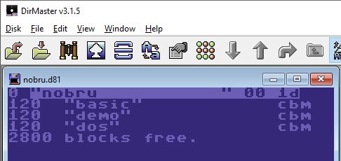
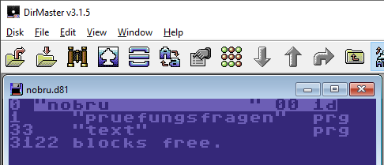

# make.cmd

A Windows command script to create sub-directories within a .D81 diskette image file.
The structure is given by subfolders on your PC. See the script itself to set up your
folders.

After the script creates the same subfolders in the .D81 it adds all files .BAS from
the structure on your PC. It uses PETCAT to convert ASCII BASIC files into programmes
to be copied into the .D81 with C1541. Unfortunately PETCAT does not know all BASIC
tokens of a Mega65. So not all BASIC commands will work.

The BASIC command to create every sub-directory is actually a binary .PRG file created
by the script without the use of PETCAT. The BASIC programme is executed by calling
Xemu65. Xemu is terminated right after the creation of the directory. The files are
copied using C1541.

Three sub-dirs:

Contents of one sub-dir:

Issues:

* The .D81 has to be pre-existing, e.g. an empty disk image created with XEMU65.
* All PC folders to be used in the .D81 have to be lowercase.
* Since the script uses Windows' TASKKILL after every call of Xemu65 all of its
  instances are terminated without asking back.
